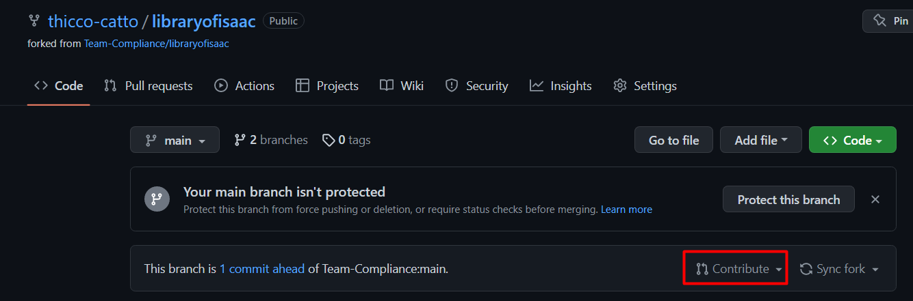

# Contributing to the Library

So you want to contribute to the library, either by adding your own enums, functions or even callbacks. Well, this page will explain what you need to do.


This page you already have some familiarity with github and vscode


### Installing the extension

To ease with developing, you'll want to install the `Library Of Isaac Dev Extension` which automatically creates a few necessary files.\
The commands this extension adds are:

* `Create Scripts`: Generates the `scripts.lua` file, which contains a list of all the files in the library so they can be required later.
* `Create Modules File`: Generates the `modules.lua` file, which declares every module in the library, so the autocomplete works properly.
* `Create Docs File`: Generates the `docs.lua` file, which contains all the function declarations and enums. This is used by the regular extension and by the next command.
* `Create GitBook`: Generates the gitbook docs from the `docs.lua` file. This is only meant to be used in the `docs` branch.

### Forking the repository

To make any changes to the library first you need to create your own copy of it, so you can safely edit it. To do this click the `Fork` button on the repository.

<figure><figcaption></figcaption></figure>

After that you can make any changes to your copy of your library.

### Creating a pull request

Once you're done changing the library,  you need to merge your copy with the main repository.

To do that go to your repository and click on `Contribute` button and click on `Open Pull Request`.

<figure><figcaption></figcaption></figure>


You may need to first click `Sync fork` before being able to contribute


After that, the create pull request view will open. There you can (and should) give a descriptive title and description about what you did. Then make sure to choose the base branch as develop and finally you can click on `Create Pull Request`.

<figure><figcaption></figcaption></figure>

## Rules for contributing

To make sure your changes get accepted you will need to follow a set of rules.

### Keep things separate

Each file should only have directly related functions. \
You should not put a function to check if the player is the lost in the same file you put another function that gives the player full health.

### Don't be too specific

To avoid bloating the library avoid adding overly specific features to the library.\
We don't need a function that checks if all the players have exactly 10 coins.

### Add luadocs

Luadocs are the comments that start with `---` before every function in the library. They allow for documentation to be shown when hovering over them.

Everything you add should have luadocs that explaning what your function does, the types of its parameters and the type of its return. Be sure to be as clear as possible, it's always better to have more words than to have a description that people can't understand.

On top of that, your luadocs have to follow an style so they are consistent with the rest of the library and the autogenerating docs work properly.

```lua
---Helper function to add 2 numbers together.
---@param number1 integer @The first number that will be added
---@param number2 integer @Default: 0 | The second number
---@return integer
function TSIL.Module.AddNumbers(number1, number2)
    number2 = if number2 then number2 else 0
    return number1 + param2
end
```

Documentation for custom callbacks is a little bit different since it needs to be inside the enum itself.

```lua
--Works exactly the same as the regular `POST_NPC_UPDATE` callback but
--let's you specify more arguments for filtering.
--
--Params:
--
-- * entity - EntityNPC
--
--Optional args:
--
-- * entityType - EntityType
-- * entityVariant - integer
-- * entitySubType - integer
POST_NPC_UPDATE_FILTER = "POST_NPC_UPDATE_FILTER",
```

### Creating callbacks

To create a callback, first you need to add an entry for it in the `CustomCallback` enum.

Then you'll need to register it using `TSIL.__RegisterCustomCallback()`.

You should only ever register one callback per file.

### Callback and `use` comments

The library also uses some special comments to denote some special files that will be treated differently by the extension when it needs to build the project.

All files that register a callback need to start with a comment with the following structure:

```lua
--##CALLBACK_ENUM
```

If your features requires another file to run, but that file doesn't declare any functions or things that would get picked up by the extension when building the project, you need to use an `use` comment with the following structure:

```lua
--##use path/to/the/file.lua
```
