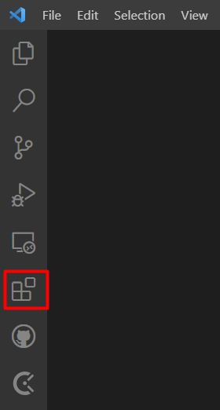
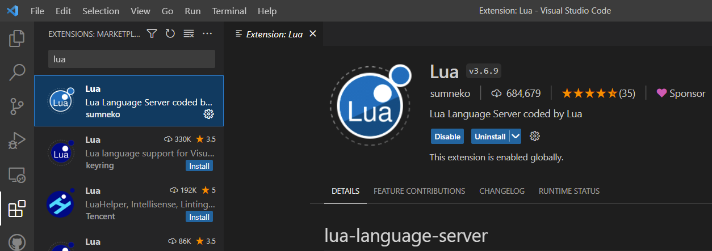
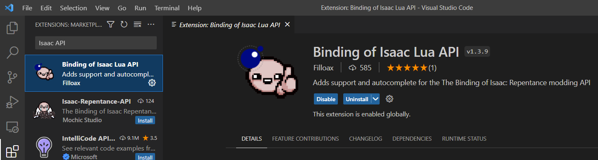
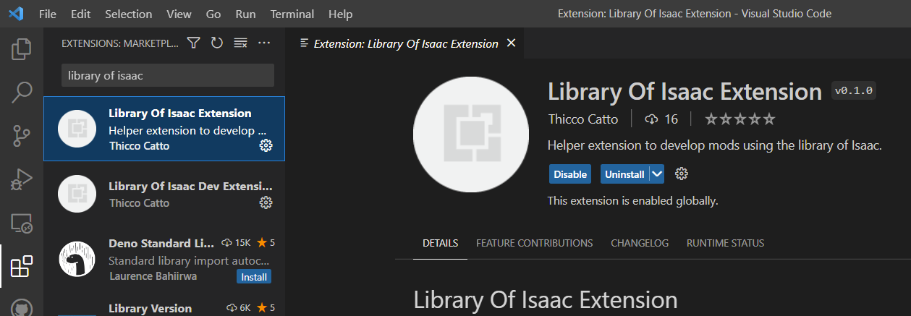

# Using the Extension

Using the Visual Studio Code extension is the easiest and most efficient way of using the library, this page shows how to set it up.

### Install Visual Studio Code

If you haven't already, you first need to install VSCode. It's a lightweight code editor that allows for amazing customization and the installation of plugins/extensions to improve your coding experience.

To get it simply visit [their website](https://code.visualstudio.com/) and click on one of the two big download buttons. After you download the installer, simply execute it and follow the instructions.

### Install the necessary extensions

To make the most use of the library, and to make coding Isaac mods, you first need to install two extensions related to lua and Isaac.

You can get the extensions here:

* [Lua server extension](https://marketplace.visualstudio.com/items?itemName=sumneko.lua) (by Sumneko)
* [Isaac API autocomplete](https://marketplace.visualstudio.com/items?itemName=Filloax.isaac-lua-api-vscode) (by Fillowax)
* [Library Of Isaac Extension](https://marketplace.visualstudio.com/items?itemName=ThiccoCatto.library-of-isaac-extension) (by us!)

Alternatively you can install these manually from VSCode by following the next steps:

First, you'll need to go to the extension tab.&#x20;

<figure><figcaption></figcaption></figure>

Then in the search bar, look up `lua`. Install the extension made by `sumneko` (It'll probably be the first result). Click on it and then click the `install` button.

<figure><figcaption></figcaption></figure>

Once you download it, search for `Isacc API` and install the extension made by `Filloax`.

<figure><figcaption></figcaption></figure>

And finally, search for `Library Of Isaac` and install the extension made by `Thicco Catto`


Install the extension called `Library Of Isaac Extension,` NOT `Library Of Isaac Dev Extension`


<figure><figcaption></figcaption></figure>

### Using the extension

The extension provides 2 commands `Init Isaac Project` and `Build Isaac Project`.

To use these commands you need to open the Command Palette, accessible in the `View` tab, or by pressing `ctrl+shift+p`.

The `Init Isaac Project` initializes your project, so you can use autocomplete without actually having all of the library in your project.

The `Build Isaac Project` puts only the necessary files in your mod so the parts of the library you used will work.\
The first time you use it it will create a default folder for the library. You will need to change its name to avoid conflicts with other mods.
